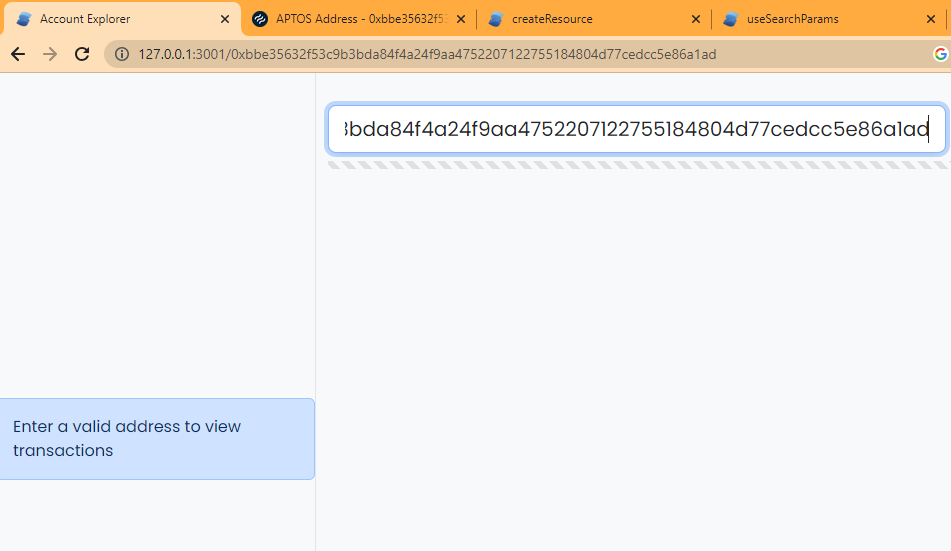
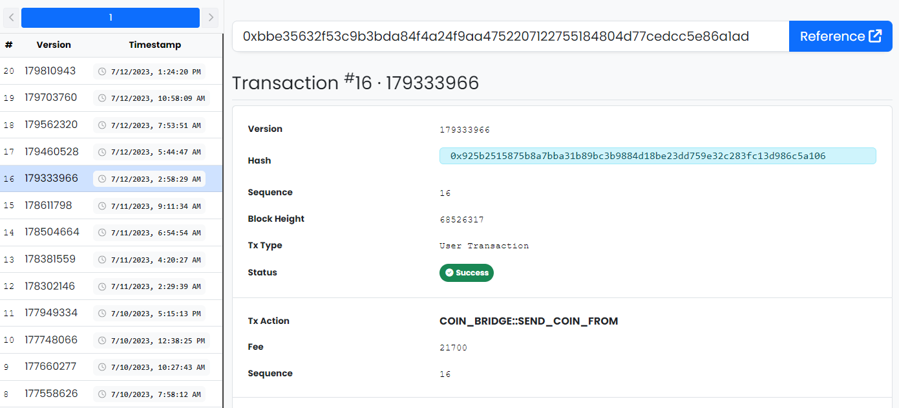

# A simple Aptos wallet explorer


## Tech Stack
- Docker Compose
- Postgres
- Node.js
- SolidJs

### Local Development
```sh
# Server
cd ./server && yarn && yarn dev

# Client
cd ./client && yarn && yarn dev

# Postgres
docker compose up db
# or run a local postgres 
```

### Testing

#### Run with Docker

  ```sh
  docker compose up --build
  ```

#### Open the client in your browser

<http://localhost:3001>
<http://127.0.0.1:3001>


#### Paste an Aptos address into the text bar at the top

  

#### Transactions should begin showing up

  - The backend will begin fetching transactions in batches from `https://fullnode.mainnet.aptoslabs.com/v1`
  - The server will send a 202 with Retry-After 10 seconds
  - Client will re-request after 10 seconds
  - Subsequent requests will return data from the database

  

<style>
img {
  width: 100%;
  height: auto;
}
</style>