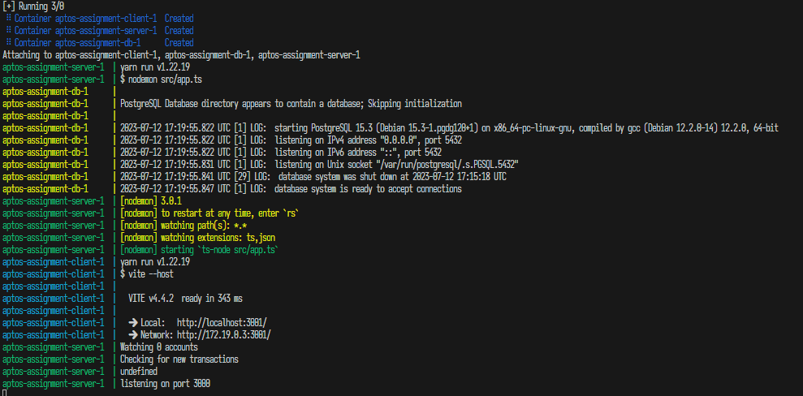

# A simple Aptos wallet explorer


## Tech Stack
- Docker Compose
- Postgres
- Node.js
- SolidJs

## Getting Started

<http://localhost:3001>
<http://127.0.0.1:3001>

### Docker
```sh
docker compose up --build
```


### Local Development
```sh
# Server
cd ./server && yarn && yarn dev

# Client
cd ./client && yarn && yarn dev

# Postgres
docker compose up db
# or run a local postgres 
```

### Testing

#### 1. Paste an Aptos address into the text bar at the top


#### 2. Transactions should being showing up


<style>
img {
  width: 100%;
  height: auto;
}
</style>